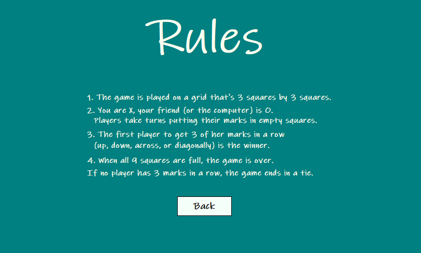

# TicTacToe-Vba

Three panels: 
  - Home Panel
  - Play Panel
  - About Panel

######  Details
  - Play Button send to the panel where the actual game is, there I have a header that specifies who should make the next move,
  the score from that game session, a New Game button, a Reset button that resets the score and an Exit button that returns to the main page.
  I used buttons for the grid, they become inactive when a win condition is met, and the buttons that meet that condition turn green.
  - About button sends you to a panel where the rules of the game are specified, there is also a back button that sends you back to the main page. 
  - Exit button closes the application.

###### Images

 
  
 

